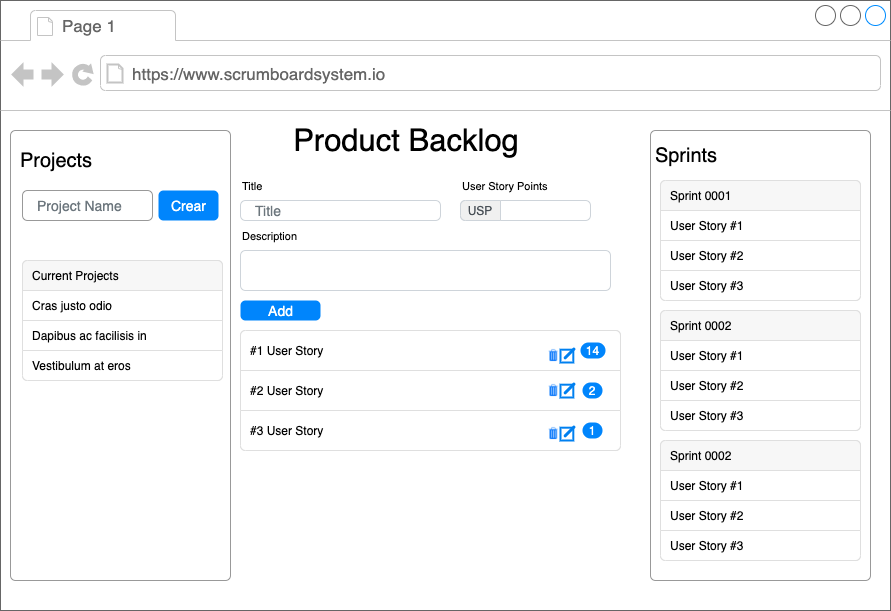

# ScrumBoardSystem-react
This project is the frontend client application for the Scrum Board System backend.
it's intented to be un reactjs using bootstrap for styling and axios as http client.

### Design Proposal Wireframe
 This is the design proposal for a simple SPA with all the main features, Projects, Sprints and User Stories.

 